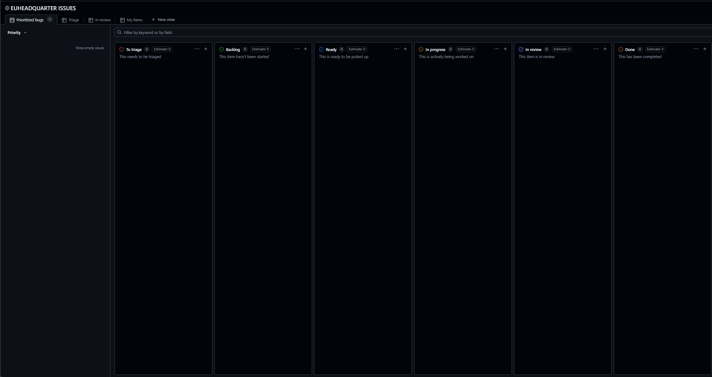

# Conflict Escalation Modern

## Overview

Conflict Escalation Modern is a modern warfare conversion of the Conflict Escalation experience for Arma Reforger, developed and maintained by the EU Headquarters community.

The project focuses on delivering a large-scale, immersive modern combat environment featuring contemporary weapons, vehicles, equipment, factions, and gameplay mechanics while maintaining the strategic and teamwork-oriented gameplay that Conflict Escalation is known for.

---

## Beta Testing

We are currently in active development and testing.

We are looking for dedicated players willing to help us identify bugs, gameplay issues, balancing problems, and performance concerns before public release.

### Important

**All bug reports and issues must be submitted through GitHub.**

Reports made only in Discord may be missed or forgotten. GitHub allows us to properly track, organize, prioritize, and resolve issues efficiently.

Before creating a new issue:

* Search existing issues first.
* Verify the issue can be reproduced.
* Include as much information as possible.
* Attach screenshots, videos, logs, or reproduction steps whenever available.

---

## Reporting Bugs

When reporting an issue, please include:

### Bug Description

A clear explanation of what happened.

### Expected Behavior

What should have happened instead.

### Reproduction Steps

1. Step one
2. Step two
3. Step three

### Additional Information

* Server Name
* Map
* Faction
* Player Count
* Screenshots
* Videos
* Client Logs (if available)
---

## Contributing

Community feedback is one of the most important parts of development.

You can contribute by:

* Testing new builds
* Reporting bugs
* Suggesting improvements
* Providing balance feedback
* Stress testing systems
* Verifying fixes

---

# Issue Workflow Guide

## How to Report a Bug

1. Open the **Issues** section.
2. Click **New Issue**.
3. Provide a clear title and description.
4. Include reproduction steps, screenshots, videos, or logs if available.
5. Submit the issue.

The issue will automatically appear in **To Triage**.

---

## Workflow Stages

### 🔴 To Triage

Newly submitted issues.

The development team reviews the report and determines:

* Is the bug valid?
* Can it be reproduced?
* Is more information required?

If confirmed, the issue moves to **Backlog**.

---

### 🟢 Backlog

The issue has been confirmed.

The bug is known and scheduled for future work but has not yet been assigned.

---

### 🔵 Ready

The issue has been prioritized and is ready for a developer to work on.

---

### 🟡 In Progress

A developer is actively investigating or fixing the issue.

---

### 🟣 In Review

The fix has been completed and is awaiting testing or verification.

Community testers may be asked to confirm the issue has been resolved.

---

### 🟠 Done

The issue has been fixed, tested, and closed.

No further action is required.

---

## Tips for Better Bug Reports

✅ Use a descriptive title.

✅ Include steps to reproduce the issue.

✅ Attach screenshots or videos whenever possible.

✅ Include server name, map, faction, and any relevant details.

✅ Check existing issues before creating a new one.

❌ Do not report multiple unrelated bugs in a single issue.

❌ Do not post bug reports only in Discord. Always create a GitHub issue so it can be tracked properly.

---

## Example

**Title:**
M1A2 Abrams cannot repair at vehicle depot

**Description:**
The M1A2 Abrams does not receive repair options when parked inside a vehicle depot.

**Steps to Reproduce:**

1. Spawn M1A2 Abrams
2. Drive to vehicle depot
3. Park inside repair zone
4. Observe missing repair interaction

**Expected Result:**
Repair option should appear.

**Actual Result:**
No repair option is available.

## Community

Join the EU Headquarters community:

**Website:** https://euheadquarter.com

**Discord:** https://dsc.gg/euhq

---

## Disclaimer

Conflict Escalation Modern is currently under active development.

Features, mechanics, balancing, assets, and gameplay systems are subject to change at any time during testing.

---

## Thank You

A huge thank you to all testers, contributors, and community members helping us improve Conflict Escalation Modern.

Your reports and feedback directly help shape the future of the project.
